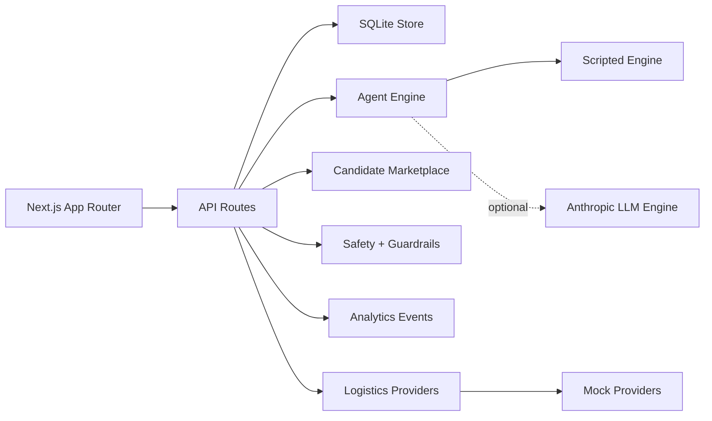

# Red String - Agentic Dating App

Red String is an agentic relationship product for people who want fewer, better first dates and a calmer way to build what comes after. A user's AI agent builds a relationship persona, screens candidates, talks to other agents, explains compatibility, handles date logistics, learns from post-date feedback, and can graduate a mutual match into an early-relationship copilot.

## What It Does

1. Builds a relationship persona from basics, connected sources, notes, AI memory imports, and photos.
2. Publishes discoverable user personas into a persistent candidate marketplace.
3. Ranks candidates by values, interests, life-stage fit, schedule style, freshness, and safety filters.
4. Streams an agent run: dealbreaker screening, compatibility scoring, and agent-to-agent conversation.
5. Enforces a match threshold before a date can be proposed.
6. Requires mutual interest for real user-owned candidates.
7. Proposes a venue, time, and warm-up call through a logistics provider layer.
8. Collects post-date feedback and shows prediction accuracy over time.
9. Supports reporting, blocking, rate limits, moderation checks, analytics, and local persistence.
10. Converts eligible mutual matches into relationship mode with consent from both partners.
11. Coordinates shared plans, check-ins, partner preferences, communication guidance, and friction signals.

## Quick Start

```bash
git clone https://github.com/angellocodestoo/agenticdatingapp.git
cd agenticdatingapp
npm install
npm run dev
```

Open [http://localhost:3000](http://localhost:3000).

## Demo Path

| Step | Route | What to do |
|------|-------|------------|
| 1 | `/onboarding` | Add basics, connect sources, add context, and build a persona |
| 2 | `/persona` | Review assumptions, values, and dealbreakers |
| 3 | `/settings` | Choose threshold, radius, pool size, and discoverability |
| 4 | `/agent-run` | Send the agent out and review qualified matches |
| 5 | `/history` | Confirm proposals, answer mutual-interest requests, and submit feedback |
| 6 | `/insights` | Review confidence, funnel analytics, learning, and prediction accuracy |
| 7 | `/relationship` | Review relationship-mode spaces, consent state, and next actions |
| 8 | `/relationship/settings` | Set partner preferences, shared profile fields, and sharing level |
| 9 | `/relationship/planner` | Suggest, accept, decline, and complete shared plans |
| 10 | `/relationship/check-in` | Submit private or shared check-ins and review guidance |

## Phase 1 Capabilities

### Dating Agent

- Persona builder
- Agent settings
- Discoverability controls
- Persistent candidate marketplace
- Candidate ranking
- Block/report filtering
- Agent-to-agent screening
- Match threshold enforcement
- Mutual-interest lifecycle
- Date proposal flow
- Warm-up call scheduling
- Feedback-based learning

### Trust And Safety

- Report and block actions
- Blocked candidates removed from future runs
- Basic text moderation for notes, imports, reports, and feedback
- Rate limits on sensitive write routes
- Upload MIME, size, signature, and dimension validation
- Server-side safety event storage

### Analytics

- Server-side funnel event tracking
- Signup, profile, persona, agent run, match, mutual interest, date, feedback, and safety events
- Insights dashboard summary
- Match prediction accuracy based on real date feedback

### Provider Architecture

The app currently uses local mock providers, but date logistics are isolated behind provider interfaces:

- Availability provider
- Venue provider
- Masked call provider

This makes production swaps for calendar availability, places, and phone masking straightforward.

## Phase 2 Capabilities

### Relationship Mode

- Eligibility checks from mutual interest, date proposal, real user ownership, and safety state
- Two-sided relationship membership
- Accept, decline, pause, resume, and leave actions
- Safety actions disable relationship mode
- Relationship dashboard

### Partner Preferences

- Shared relationship profile
- Relationship stage
- Shared values
- Quality-time preferences
- Communication norms
- Planning cadence
- 30-day goal
- Partner preference card
- Per-member sharing level

### Shared Planner

- Relationship-owned shared plans
- AI-suggested date-night plans using the logistics provider layer
- Custom plans
- Accept, decline, and complete flow
- Plan analytics

### Check-Ins And Guidance

- Private, summary, or shared check-ins
- Mood, closeness, energy, and stress scores
- Appreciation, needs, and private notes
- Communication guidance from explicit preferences and recent check-ins
- Non-diagnostic friction signals with small repair actions

### Phase 2 Analytics

- Relationship invitations, acceptances, pauses, resumes, and safety disables
- Plans suggested, accepted, declined, and completed
- Check-ins submitted
- Guidance views
- Friction signals surfaced

## Architecture



## Key Files

| Area | Files |
|------|-------|
| Auth and sessions | `src/lib/auth.ts`, `src/app/api/auth/route.ts` |
| Persistence | `src/lib/db.ts`, `src/lib/store.ts` |
| Marketplace | `src/lib/marketplace.ts`, `src/app/api/candidates/route.ts` |
| Agent run | `src/app/api/agent-run/route.ts`, `src/app/agent-run/page.tsx` |
| Mutual interest | `src/app/api/mutual-interest/route.ts`, `src/app/history/page.tsx` |
| Safety | `src/app/api/safety/route.ts`, `src/lib/guardrails.ts` |
| Logistics | `src/lib/logisticsProviders.ts` |
| Insights | `src/app/api/insights/route.ts`, `src/app/insights/page.tsx` |
| Relationships | `src/app/api/relationships/route.ts`, `src/app/relationship/page.tsx` |
| Relationship settings | `src/app/api/relationships/[id]/route.ts`, `src/app/relationship/settings/page.tsx` |
| Shared planner | `src/app/api/relationships/[id]/plans/route.ts`, `src/app/relationship/planner/page.tsx` |
| Check-ins and guidance | `src/app/api/relationships/[id]/check-ins/route.ts`, `src/app/relationship/check-in/page.tsx` |
| Friction insights | `src/app/api/relationships/[id]/insights/route.ts` |

## Configuration

Create `.env.local` if using optional integrations:

```env
ANTHROPIC_API_KEY=sk-ant-...
ANTHROPIC_MODEL=claude-sonnet-4-6
SPOTIFY_CLIENT_ID=...
SPOTIFY_CLIENT_SECRET=...
SPOTIFY_REDIRECT_URI=http://localhost:3000/api/connect/spotify/callback
```

Without these variables, Red String still runs locally with scripted agents and mock providers.

## Scripts

```bash
npm run dev
npm run build
npm run start
npm run lint
npm audit --audit-level=moderate
```

## Production Notes

Phase 1 and Phase 2 now have the product backbone for agentic dating and early relationship support. Remaining production swaps are mostly provider, operations, and review tooling work:

- Replace mock availability with calendar provider.
- Replace mock venue recommendations with a places provider.
- Replace mock masked numbers with a phone provider.
- Move from local SQLite to managed persistent storage for multi-instance deployment.
- Add admin review tooling for reports and moderation queues.
- Add production notification delivery for relationship invites, plans, and check-ins.
- Add deeper admin audit trails for relationship-mode safety events.

## Phase 2

Phase 2 expands Red String into an early-relationship copilot for mutually opted-in matches. See [docs/phase-2-prd.md](docs/phase-2-prd.md) for the original build plan.

## Phase 3

Phase 3 expands Red String into a marriage and household operating system for couples building a shared life. See [docs/phase-3-prd.md](docs/phase-3-prd.md) for the build plan.
