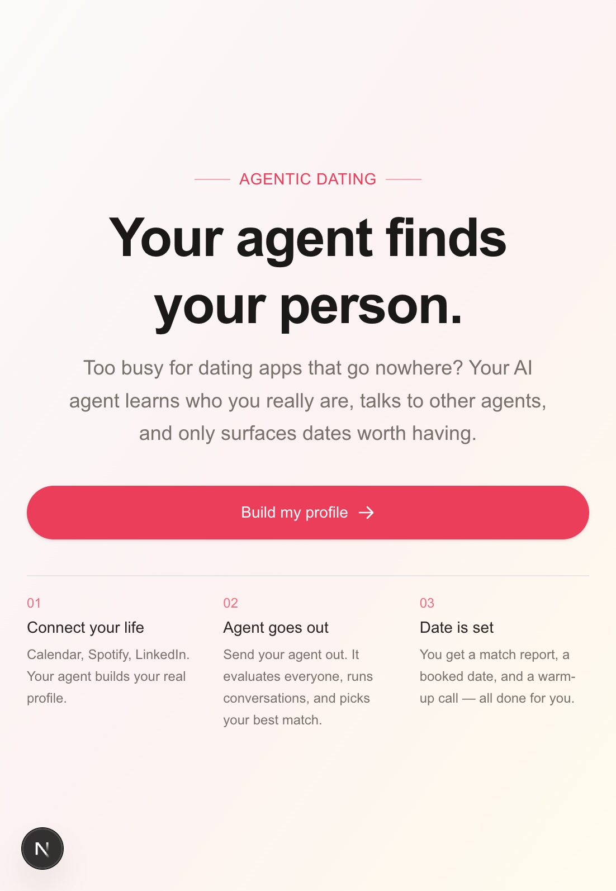
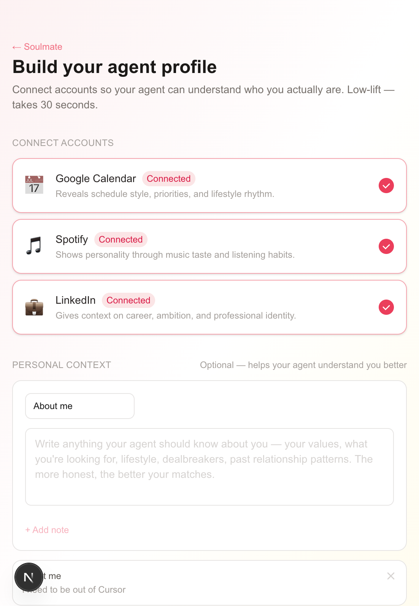
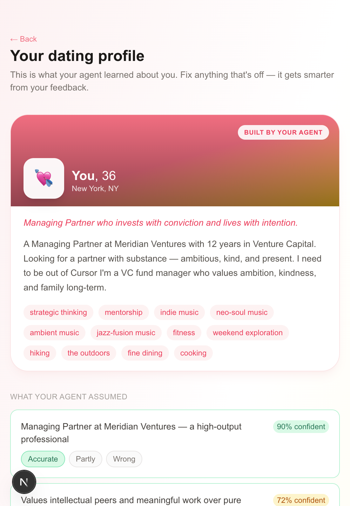
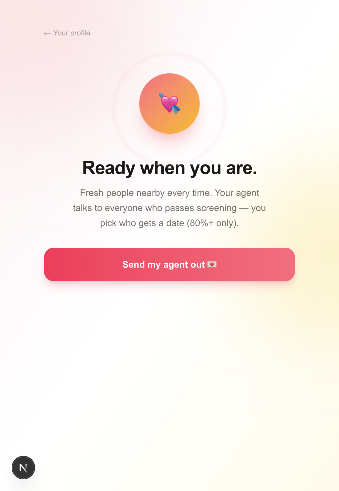
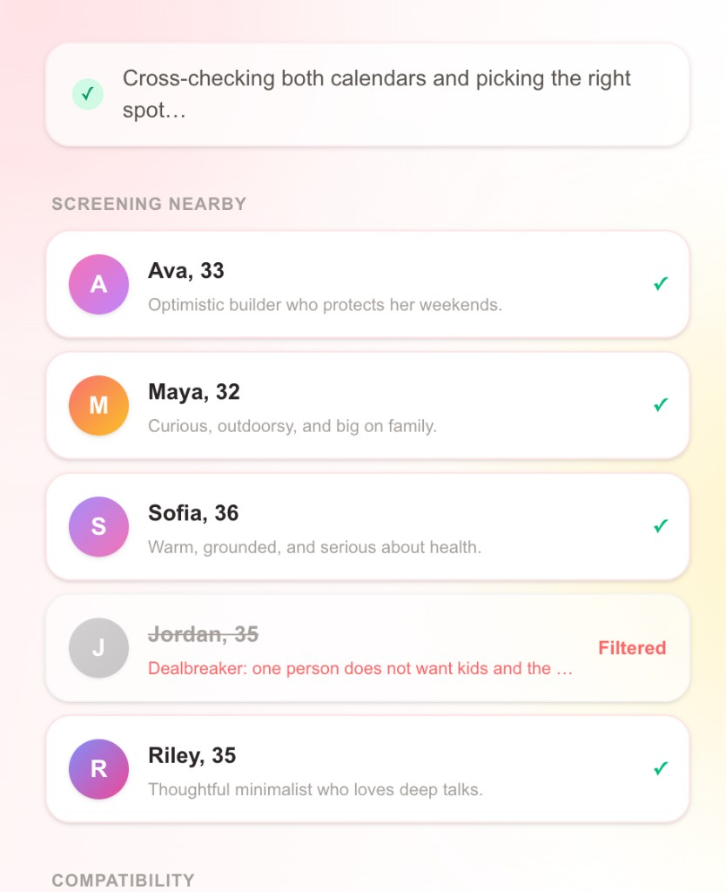
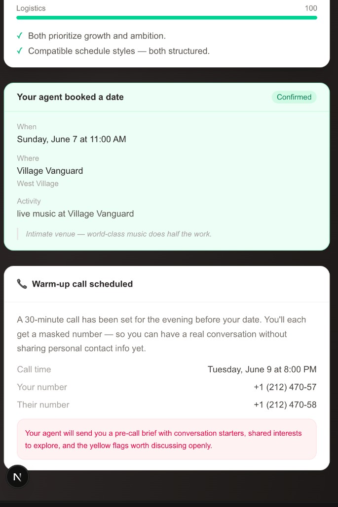
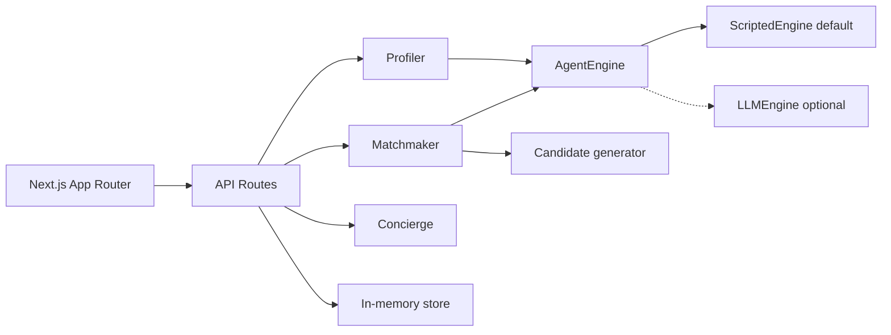

# Soulmate — Agentic Dating App

<p align="center">
  <strong>Your AI agent learns who you really are, talks to other agents, and only surfaces dates worth having.</strong>
</p>

<p align="center">
  <a href="#quick-start">Quick start</a> ·
  <a href="#how-it-works">How it works</a> ·
  <a href="#screenshots">Screenshots</a> ·
  <a href="#architecture">Architecture</a> ·
  <a href="#production-roadmap">Production roadmap</a>
</p>

---

## What is Soulmate?

Soulmate is a **prototype agentic dating app** built for people who are too busy for swipe culture but still want intentional connection. Instead of browsing profiles yourself, you:

1. **Connect your life** (Calendar, Spotify, LinkedIn — mocked in the demo)
2. **Add personal context** in your own words
3. **Validate** what your agent learned about you
4. **Send your agent out** — it screens people, has real conversations with their agents, and brings back options
5. **You choose** who gets a date (only matches **above 80%** compatibility)
6. **Concierge books** the venue, time, and a warm-up call with conversation topics

No API keys required for the demo. Everything runs on a deterministic `ScriptedEngine` that can be swapped for OpenAI or Anthropic later.

---

## Quick start

### Prerequisites

- **Node.js** 18+ (tested on Node 24)
- **npm** 9+

### Install & run

```bash
git clone https://github.com/angellocodestoo/agenticdatingapp.git
cd agenticdatingapp
npm install
npm run dev
```

Open **[http://localhost:3000](http://localhost:3000)** in your browser.

### Demo path (≈3–5 minutes)

| Step | Route | What to do |
|------|-------|------------|
| 1 | `/` | Click **Build my profile** |
| 2 | `/onboarding` | Connect Calendar, Spotify, LinkedIn · paste an **About me** note · **Build my agent profile** |
| 3 | `/persona` | Rate assumptions · set values & dealbreakers · **Send my agent out** |
| 4 | `/agent-run` | Watch screening → scores → live agent chats → pick a match **80%+** → confirm date |

> **Tip:** Each agent run generates **fresh names and conversations**. Re-run `/agent-run` to see variety.

---

## How it works

### 1. Profiler — low-lift onboarding

Your agent ingests:

- **Google Calendar** — schedule style, morning routine, weekend habits
- **Spotify** — music taste and listening mood
- **LinkedIn** — career, ambition, professional identity
- **About me** (free text) — values, dealbreakers, lifestyle — always woven into bio, interests, and values

You then **rate each assumption** (accurate / partly / wrong) so the agent improves over time.

### 2. Matchmaker — agents talk, you don't swipe

When you send your agent out:

1. **Dealbreaker scan** — hard filters eliminate incompatible people instantly
2. **Compatibility scoring** — values, lifestyle, logistics (0–100)
3. **Live agent conversations** — your agent talks with each passing person's agent at human-readable pace (typing indicators, variable delays)
4. **Qualified options** — only people **above 80%** are offered for a date; you pick based on the agent's report and conversation

### 3. Concierge — date + warm-up call

After you choose a match:

- Picks a **venue** from shared interests (mock Google Places)
- Finds a **time** from mock free/busy calendars
- Schedules a **warm-up call** 3–5 days *before* the date (masked numbers)
- Suggests **two conversation topics** — one light & fun, one philosophical

---

## Screenshots

### Landing



### Onboarding — connect accounts + About me



### Persona — validate what your agent learned



### Agent run — send your agent out



### Agent screening & compatibility



### Date booked + warm-up call with topics



---

## Architecture



### Project structure

```
src/
├── app/
│   ├── page.tsx                 # Landing
│   ├── onboarding/page.tsx      # Connect sources + artifacts
│   ├── persona/page.tsx         # Review & tailor profile
│   ├── agent-run/page.tsx       # Autonomous agent mission + user choice
│   └── api/
│       ├── profile/route.ts     # Build & update persona
│       ├── agent-run/route.ts   # SSE: screen → converse → qualified matches
│       ├── match/route.ts       # Single-match streamed conversation
│       └── concierge/route.ts # Date proposal & call scheduling
├── lib/
│   ├── agent/
│   │   ├── engine.ts            # AgentEngine interface
│   │   ├── scriptedEngine.ts    # Zero-key deterministic brain
│   │   └── llmEngine.ts         # OpenAI / Anthropic stub
│   ├── candidateGen.ts          # Fresh randomized candidates each run
│   ├── matchThreshold.ts        # 80% date eligibility threshold
│   ├── integrations/mock.ts     # OAuth, calendar, places, Twilio mocks
│   ├── avatar.ts                # Gradient avatars, age, distance
│   └── store.ts                 # In-memory session state
└── data/
    └── candidates.ts            # Fallback seed data (dev)
```

### Key design decisions

| Decision | Why |
|----------|-----|
| **ScriptedEngine default** | Demo works offline with zero API keys; deterministic for hackathons |
| **SSE streaming** | Agent conversations feel live; typing indicators + human-paced delays |
| **Randomized candidates** | Names, bios, and dialogue change every run — not a static script |
| **80% threshold** | Only strong matches get a date proposal; user always has final say |
| **Pluggable integrations** | Each mock is one file away from a real API swap |

---

## Configuration

| Constant | Location | Default |
|----------|----------|---------|
| Date eligibility threshold | `src/lib/matchThreshold.ts` | **80** (must be *above* 80%) |
| Candidates per run | `src/lib/candidateGen.ts` | **5** |

---

## Plugging in a real LLM

1. Create `.env.local`:

```env
OPENAI_API_KEY=sk-…
# or
ANTHROPIC_API_KEY=sk-ant-…
```

2. Implement `buildPersona` and `converse` in [`src/lib/agent/llmEngine.ts`](src/lib/agent/llmEngine.ts).

3. Swap `scriptedEngine` for `llmEngine` in API routes when a key is present.

---

## Production roadmap

| Mock today | Production swap |
|------------|-----------------|
| Google Calendar free/busy | Google Calendar API |
| OAuth buttons | Google / LinkedIn OAuth 2.0 |
| Spotify profile | Spotify Web API |
| Venue picker | Google Places API |
| Masked phone | Twilio Proxy |
| In-memory store | Postgres + Prisma |
| ScriptedEngine | LLM + persistent agent memory |

---

## Scripts

```bash
npm run dev      # Start dev server (Turbopack)
npm run build    # Production build
npm run start    # Start production server
npm run lint     # ESLint
```

---

## Tech stack

- **Next.js 16** (App Router) · **React 19** · **TypeScript**
- **Tailwind CSS 4**
- **Server-Sent Events** for streamed agent conversations

---

## License

MIT — use freely for demos, hackathons, and learning.

---

<p align="center">
  Built for busy people who want dating to feel intentional, not like a second job.
</p>
